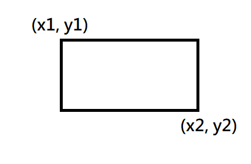
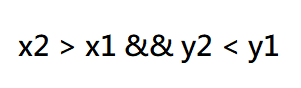
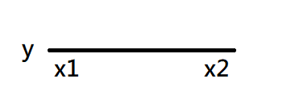
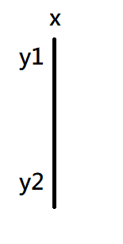

# rectanglesCalculator

This application was implemented using java 8

## Rectangle model:

A rectangle is represented by two points as described in this image:



A well formed rectangle satisfies this rule:



## Line model:

Also we have lines, A horizontal line (LineH) goes from x1 to x2, having a static y value:



Vertical line (LineV) goes from y1 to y2, having a static x value:



We use this Line models to analize adjacency.

## json input for API endpoints:

this is the only accepted json format, two rectangles represented by two points each:

```json
[
  {
    "p1":{
      "x":4,
      "y":5
    },
    "p2":{
      "x":8,
      "y":1
    }
  },
  {
    "p1": {
      "x":5,
      "y":4
    },
    "p2":{
      "x":7,
      "y":2
    }
  }
]
```

## API usage:

### containment:
http://localhost:8080/rectangles/containment

result example:

```json
{
  "state": true,
  "desc": "Rectangle A is wholly contained within rectangle B"
}
```

### intersection:
http://localhost:8080/rectangles/intersection

result example:

```json
{
  "state": true,
  "desc": "Rectangles have one or more intersecting lines",
  "intersectionPoints": [
    {
      "x": 5,
      "y": 9
    },
    {
      "x": 3,
      "y": 11
    }
  ]
}
```

### adjacency:
http://localhost:8080/rectangles/adjacency

result example:

```json
{
  "state": true,
  "desc": "There is partial adjacency in the Rectangles",
  "type": "PARTIAL_ADJACENCY"
}
```


